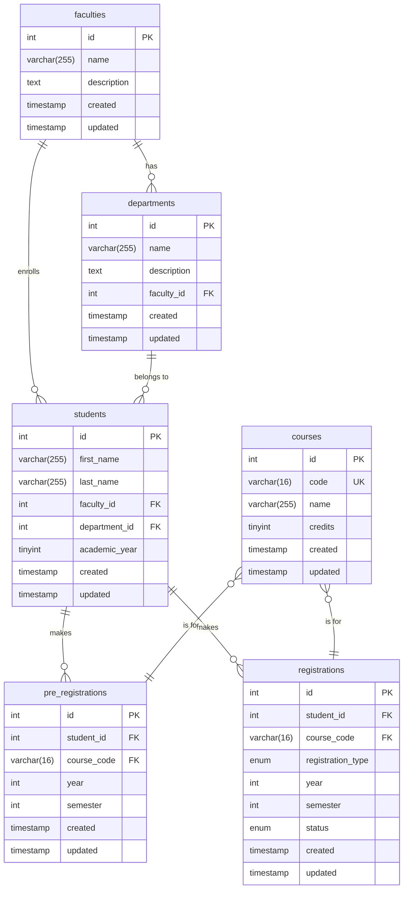
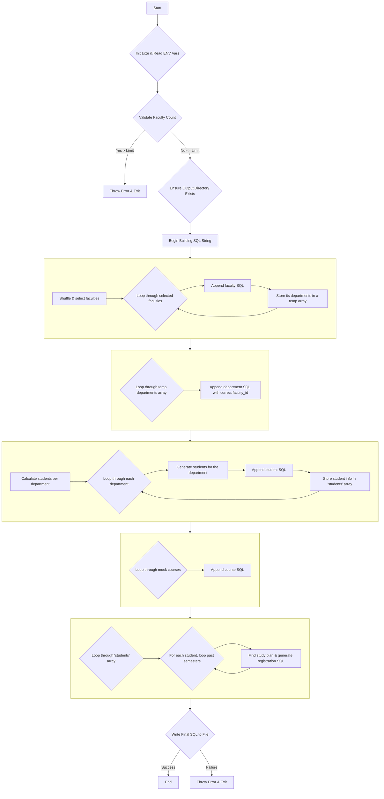

# university-registration

Generate test data for unvidersity registration process.

## How to run

1. To start MySQL database:

   ```sh
   make university_db
   ```

2. To stop MySQL database:

   ```sh
   make down
   ```

3. To generate new set of test data:

   Parameters:

   - TOTAL_FACULTIES (max 22 faculties)
   - TOTAL_STUDENTS
   - REGISTRATION_SEMESTER (1 or 2)

   ```sh
   make seed_university_data
   ```

   After generated new test data run `make down` and `make university_db` to restart database.

## Database diagram



## Generate test data flow chart


